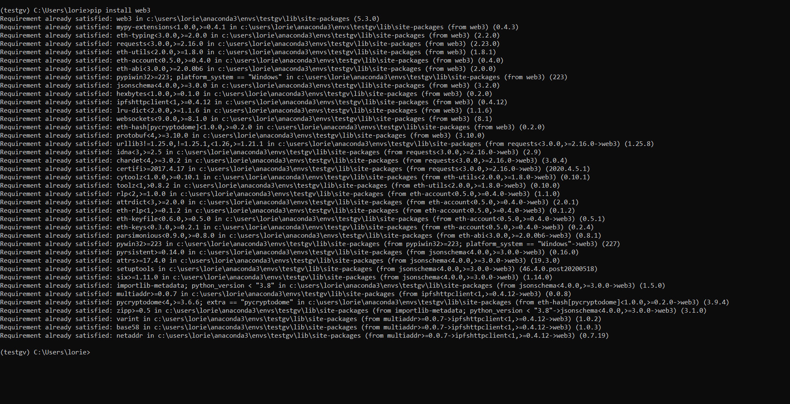

# HDWALLET -HW19
Design a Universal Wallet using a command line tool that integrates with python script to transact the most popular wallets.
This tool will alow users to send transactions between different addresess based on the coins selected. For the pupose of simplicity the tool currently handles BTC and ETH blockchain, but can be enhanced to include all altcoins and integrated into a web portal. Since this is not integrated to a user interface, the code is written to execute either BTC or ETH and and then run the tool to complete the transaction.  


# Installation requirements
Follow the step by step process for setting up and validating the [`web3.py`](https://web3py.readthedocs.io/en/stable/), [`bit`](https://ofek.dev/bit/), and [`hd-wallet-derive`](https://github.com/dan-da/hd-wallet-derive  ) libraries used to programmatically send and receive transactions over a blockchain network via virtual wallets. 

## Installing web3.py
Open a terminal and execute the following commands to install `web3.py` and `bit`, respectively. Windows users **MUST** use the _Anaconda Prompt_ in this section.

* Open the terminal and run the following command to create a brand new Python virtual environment for this unit.

  ```shell
  conda create -n ethereum python=3.7 anaconda
  ```

* Activate the new environment.

  ```shell
  conda activate ethereum
  ```

* Use the `pip install` command to download and install the `web3.py` module.

  ```shell
  pip install web3
  ```

  

## Installing bit
* Use the `pip install` command to download and install the `bit` module.

  ```shell
  pip install bit
  ```

  


## Installing hd-wallet-derive 
This library is used to derive BIP32 addresses and private keys for Bitcoin and other alternative coins or "altcoins."

*Pre-requisite:*

The latest version of PHP should be installed in your machine. Please follow instructions from prior class on how to install PHP in your machine.
We can now proceed to the installation of the `hd-wallet-derive` library.

1. Begin by opening a fresh git bash terminal. Windows users **must** open their terminal as administator as follows:

    * Input `C:\Program Files\Git\bin\bash.exe` directly into the system search bar and launch the program as _Administrator_ from the resulting menu.
    
    * **This step is required or the installation will fail!**

    * 

2. Create a new folder `wallet` in your homework directory. With your terminal open as indicated for your operating system, cd into your `wallet` folder and run the following code:

    ```shell
      git clone https://github.com/dan-da/hd-wallet-derive
      cd hd-wallet-derive
      curl https://getcomposer.org/installer -o installer.php
      php installer.php
      php composer.phar install
    ```

3. You should now have a folder called `hd-wallet-derive` containing the PHP library under your `wallet` directory  

    
    

4. Verification

    1. Run the command to `cd` in your `hd-wallet-derive` folder.

    2. Once you've confirmed you are in your `hd-wallet-derive` folder, execute the following command:

    ```shell
    ./hd-wallet-derive.php -g --key=xprv9tyUQV64JT5qs3RSTJkXCWKMyUgoQp7F3hA1xzG6ZGu6u6Q9VMNjGr67Lctvy5P8oyaYAL9CAWrUE9i6GoNMKUga5biW6Hx4tws2six3b9c --numderive=3 --preset=bitcoincore --cols=path,address --path-change
    ```

    3. If installation was successful, you should see output similar to what you see in the following image:

            

5.  Windows users need to execute the following in a separate git-bash terminal with option "Run as administrator". Switch to `ethereum` environment

    ```shell
    conda activate ethereum
    ```
    ```shell
    export MSYS=winsymlinks:nativestrict
    ```
6.  Set shortcut to derive command so that python script can be simplified

    ```shell
    ln -s hd-wallet-derive/hd-wallet-derive.php derive
    ```  

## Python scripts
Create two python scripts `wallet.py` and `constants.py` in the directory `wallet`. Please see the scripts code in the `wallet` directory for details


## Sending transactions

For this exercise the 3 level wallet addresses were generated for each of these blockchains

**BTCTEST addresses**  
[0] mn3fxs53QDPtnXrCGbnKW6HySNcakb33NZ   
[1] mp8rmp6GNc16DFL5NFybtV8khxgVWBMXKC  
[2] n1m94piaPnuCbawCteZ7wUwfHSjxVSRxSr

**ETH addresses**  
[0] 0x6F33fa2F1C20c95BB2C7F53cc8F204963ebCBFbF  
[1] 0xD7B48E19E4e00aD5A52332368723DF6D209054Cf  
[2] 0x679D67a351F4c2D0aD246a5171833a884c784feE  

###  Send transaction value 0.00001 BTC from BTCTEST[0] to BTCTEST[1] wallet  

* Execute python script from git-bash
    

* Source code from `wallet.py`

  

* Check transaction status using https://tbtc.bitaps.com/
  

###  Send transaction value 1 ETH from ETH[0] to third party wallet address 0x12f9d4Eda8980421f96985456b5DeA6b9eDFB069

* Balances of 2 wallet address from MyCrypto before transaction send

    MyCrypto balance before send for ETH[0] wallet address 0x6F33fa2F1C20c95BB2C7F53cc8F204963ebCBFbF
      

    MyCrypto balance before send for ETH third party wallet address 0x12f9d4Eda8980421f96985456b5DeA6b9eDFB069
      

* Source code from `wallet.py`

  

* Execute python script from git-bash
     
    
* Balances of 2 wallet address from MyCrypto after transaction send

    MyCrypto balance after send for ETH[0] wallet address 0x6F33fa2F1C20c95BB2C7F53cc8F204963ebCBFbF
      

    MyCrypto balance after send for ETH third party wallet address 0x12f9d4Eda8980421f96985456b5DeA6b9eDFB069
     
     

---